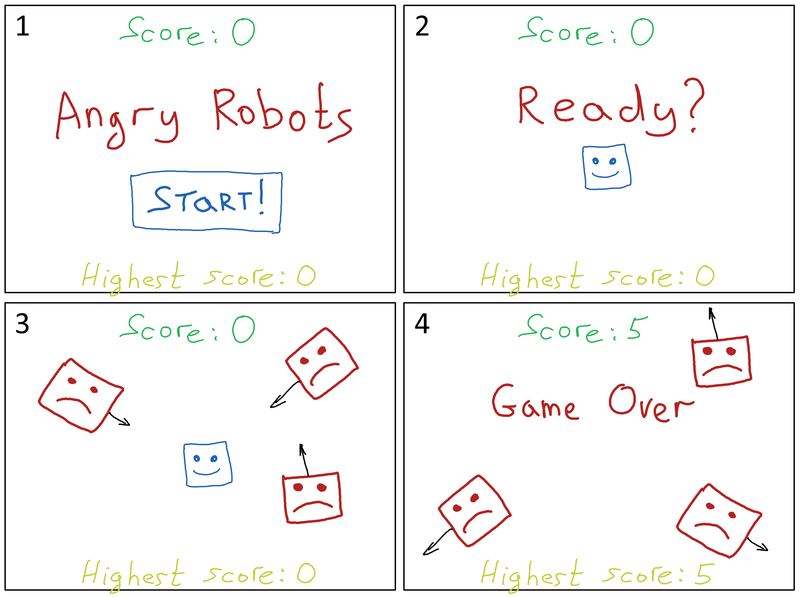
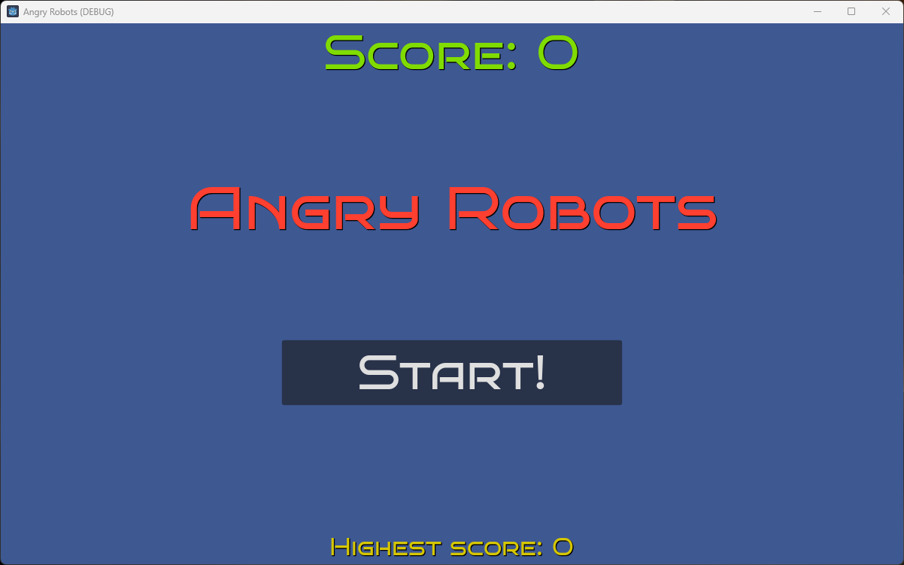
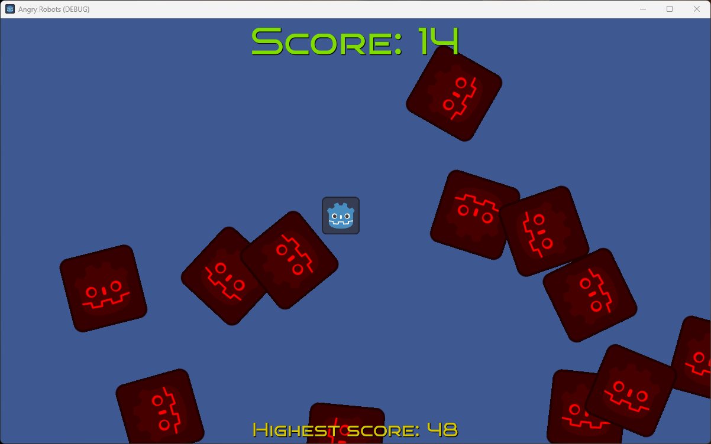

# Angry Robots game prototype

A fully functional 2D game prototype created using **Godot 4** and **GDScript**.

The idea of the game is similar to [Dodge the Creeps!](https://docs.godotengine.org/en/stable/getting_started/first_2d_game/index.html) from the Godot User Manual.

1. **Main menu:** Shows "Angry Robots" in the center of the screen, current and the highest score, and the "Start" button.

2. **"Ready?" screen:** When the player clicks the "Start" button (or presses `Enter`), the game shows the main character and the message "Ready?".

3. **Gameplay:** In a few seconds, the "Ready?" message disappears, and the enemies start to spawn randomly along the edge of the screen. They move with random speed and in random direction.

    The character can be controlled using `W`, `A`, `S`, `D` keys (or the four Arrow keys) and `Space`. The character should dodge the enemies. The player gets 1 point every 1 second.

    The character can also rapidly accelerate and hit the enemies getting 10 points for each destroyed enemy. But this is risky since there is a caveat: the character cannot accelerate immediately after the previous acceleration, i.e., there is a few second cooldown period! The enemies can destroy the character immediately after it slowed down. This is a sort of "high-risk, high-reward" situation.

4. **"Game Over" screen:** If angry robots (the enemies) hit the main character while it is not attacking, the game is over. The character disappears, the enemies keep moving out of the game window. The score counter stops.

    If the current score is larger than the highest score, the latter will be updated accordingly. The game automatically switches to the main menu (Screen 1).

## The main menu screenshot

## The gameplay screenshot

## Video

The gameplay is demonstrated in this quick YouTube [video](https://www.youtube.com/watch?v=39mzb6HAR-E).

## Tutorial

To be published.
